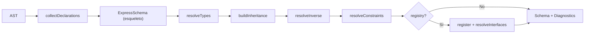
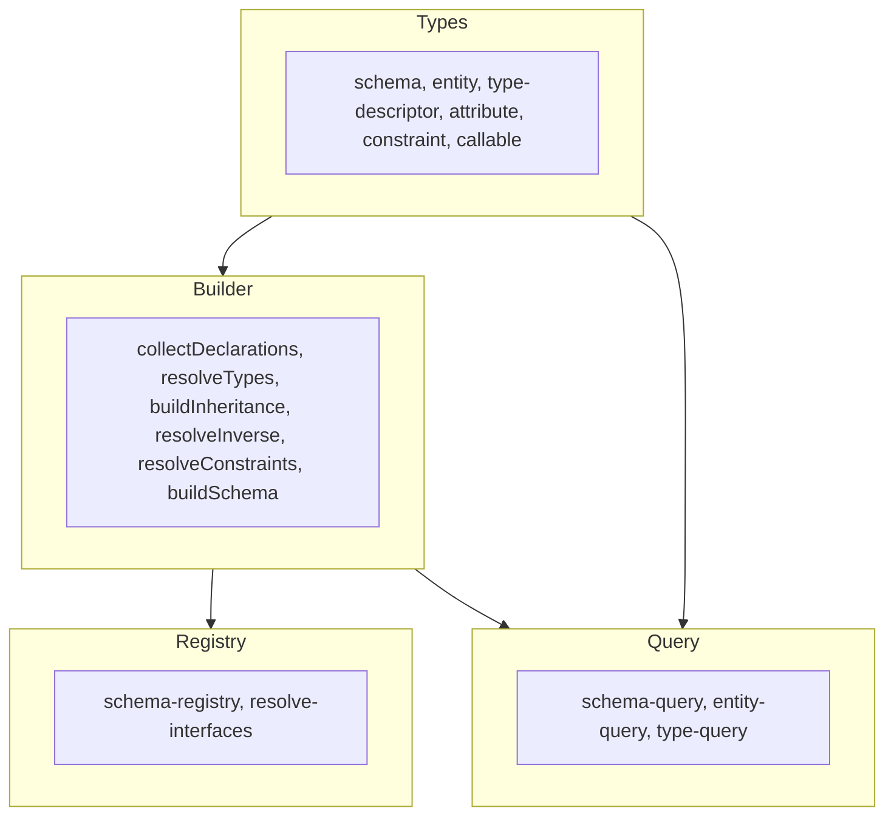
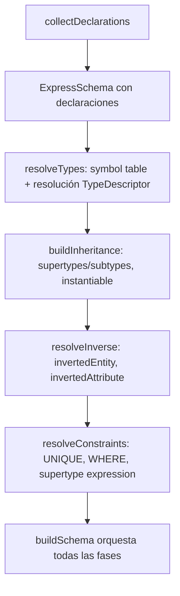

# Arquitectura del diccionario EXPRESS

## 1. Visión general

El paquete `@step-nc/express-dictionary` transforma el AST de EXPRESS (producido por `@step-nc/express-parser`) en un modelo semántico resuelto y enlazado: un **ExpressSchema** con entidades, tipos, atributos, herencia, inversos y restricciones resueltos por nombre. La entrada es un `SchemaDeclarationNode`; la salida es un `ExpressSchema` y un array de `SchemaDiagnostic[]`.

Para el **uso** y la **API** del paquete, véase [README.md](./README.md).

## 2. Pipeline de construcción

El flujo de datos es lineal:

1. **Entrada:** AST de un schema EXPRESS (`SchemaDeclarationNode`).
2. **Recolección:** `collectDeclarations(ast)` recorre el AST y crea el esqueleto del schema (entidades, tipos, funciones, etc.) con descriptores de tipo aún no resueltos.
3. **Resolución de tipos:** `resolveTypes(schema)` resuelve referencias por nombre en los `TypeDescriptor` (tipos definidos, entidades, SELECT, etc.).
4. **Herencia:** `buildInheritance(schema)` construye la jerarquía de supertipos/subtipos y marca entidades instanciables.
5. **Inversos:** `resolveInverse(schema)` enlaza atributos inversos con su entidad y atributo objetivo.
6. **Restricciones:** `resolveConstraints(schema)` resuelve referencias en reglas UNIQUE y WHERE y en expresiones de supertipo.
7. **Opcional — Registry:** Si se pasa un `SchemaRegistry`, el schema se registra y `resolveInterfaces()` resuelve cláusulas USE/REFERENCE entre esquemas.
8. **Salida:** `ExpressSchema` (con Maps por nombre) y `SchemaDiagnostic[]`.

Diagrama del pipeline:

## 3. Capas del código

El código se organiza en capas dentro de `src/`:

| Carpeta           | Responsabilidad | Archivos clave |
|-------------------|-----------------|----------------|
| `src/types/`      | Modelo semántico: esquema, entidad, tipo, atributos, descriptores de tipo, constraints, callables. | `schema.ts`, `entity.ts`, `type-definition.ts`, `type-descriptor.ts`, `attribute.ts`, `constraint.ts`, `callable.ts`, `common.ts` |
| `src/diagnostics.ts` | Códigos de diagnóstico, creación y formateo de `SchemaDiagnostic`. | `diagnostics.ts` |
| `src/builder/`    | Recolección desde AST y resolución (tipos, herencia, inversos, constraints). | `collect-declarations.ts`, `type-descriptor-builder.ts`, `resolve-types.ts`, `build-inheritance.ts`, `resolve-inverse.ts`, `resolve-constraints.ts`, `build-schema.ts` |
| `src/registry/`   | Registro de múltiples esquemas y resolución de USE/REFERENCE. | `schema-registry.ts`, `resolve-interfaces.ts` |
| `src/query/`      | API de consulta sobre el schema (entidades, tipos, atributos, herencia). | `schema-query.ts`, `entity-query.ts`, `type-query.ts` |

Relación entre capas: los **Types** definen el modelo; el **Builder** lo rellena a partir del AST; el **Registry** opcional agrupa varios esquemas; el **Query** ofrece lectura cómoda sobre el modelo.

## 4. Tipos (modelo semántico)

- **ExpressSchema:** Contenedor con `name`, `entities`, `types`, `functions`, `procedures`, `rules`, `constants`, `subtypeConstraints`, `interfaces` (USE/REFERENCE sin resolver) y `diagnostics`.
- **EntityDefinition:** Nombre, schema, abstract, supertipos/subtipos (arrays resueltos), atributos explícitos/derivados/inversos, reglas UNIQUE/WHERE, expresión de supertipo, `instantiable`.
- **TypeDefinition:** Nombre, schema, `underlyingType` (`TypeDescriptor`), `whereRules`.
- **TypeDescriptor:** Union de `simple`, `aggregation`, `enumeration`, `select`, `entity`, `defined`, `generic`, `genericEntity`, `unresolved`; los resueltos apuntan a definiciones por referencia (nombre) o a objetos enlazados.
- **Atributos:** `ExplicitAttribute`, `DerivedAttribute`, `InverseAttribute` con `TypeDescriptor` y referencias a entidad/inverso cuando aplica.
- **Constraints:** `WhereRuleDefinition`, `UniqueRuleDefinition`, `SubtypeConstraintDefinition` y `SupertypeExpressionInfo` para jerarquías.

Los tipos usan referencias ligeras (`EntityDefinitionLike`, `TypeDefinitionLike`, `SchemaHost`) para evitar dependencias circulares entre módulos.

## 5. Builder y fases

- **collectDeclarations:** Recorre el AST con la estructura conocida del parser; por cada declaración (ENTITY, TYPE, FUNCTION, etc.) crea la definición correspondiente. Los tipos se construyen con `buildTypeDescriptor` (en `type-descriptor-builder.ts`), que traduce nodos de tipo del AST a `TypeDescriptor` (pueden quedar `unresolved` o con nombres para resolver después).
- **resolveTypes:** Mantiene una tabla de símbolos por schema (entidades, tipos, etc.) y recorre todos los `TypeDescriptor` y atributos sustituyendo nombres por referencias resueltas; marca diagnósticos para tipos no resueltos.
- **buildInheritance:** Para cada entidad con `supertypeNames`, resuelve las referencias a entidades y rellena `supertypes`; propaga subtipos y calcula `instantiable` (no abstracta y con al menos un subtipo instanciable o ser hoja).
- **resolveInverse:** Para cada `InverseAttribute`, busca la entidad y el atributo explícito referenciados por nombre y enlaza `invertedEntity` e `invertedAttribute`.
- **resolveConstraints:** Resuelve atributos referenciados en `UniqueRuleDefinition` y expresiones de supertipo en `SubtypeConstraintDefinition`; rellena `supertypeExpression` y atributos resueltos de las reglas.

## 6. Registry y multi-schema

- **SchemaRegistry:** Almacena esquemas por nombre (clave en mayúsculas). Permite `register(schema)`, `buildAndRegister(ast)` (construir y registrar en un paso), `get(name)`, `list()`, `resolveInterfaces()`.
- **resolveInterfaces:** Recorre los `interfaces` (USE/REFERENCE) de cada schema registrado; para cada referencia a otro schema o a ítems de otro schema, comprueba que el schema e ítems existan y genera diagnósticos si no. No modifica el modelo semántico de cada schema; solo valida y reporta.

Útil cuando se tienen varios archivos EXPRESS que se referencian entre sí vía USE/REFERENCE.

## 7. API de consulta

Funciones puras que reciben el `ExpressSchema` (y a veces una entidad o tipo) y devuelven datos ya resueltos:

- **schema-query:** `getEntity`, `getType`, `getNamedType`, `getAllEntities`, `getAllTypes`, `getInstantiableEntities`.
- **entity-query:** `getOwnAttributes`, `getInheritedAttributes`, `getAllAttributes`, `getAllDerivedAttributes`, `getAllInverseAttributes`, `getDirectSubtypes`, `getAllSubtypes`, `getSupertypeChain`, `isSubtypeOf`, `isInstantiable`.
- **type-query:** `isSimpleType`, `isEntityType`, `isSelectType`, `isEnumerationType`, `isAggregationType`, `getSelectOptions`, `resolveToBaseType`.

Así el consumidor no necesita recorrer Maps ni resolver herencia a mano.

## Más información

- **[README.md](./README.md)** — Uso del paquete, `buildSchema`, `SchemaRegistry`, tipos exportados, diagnósticos y API de consulta con ejemplos.
