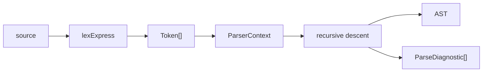
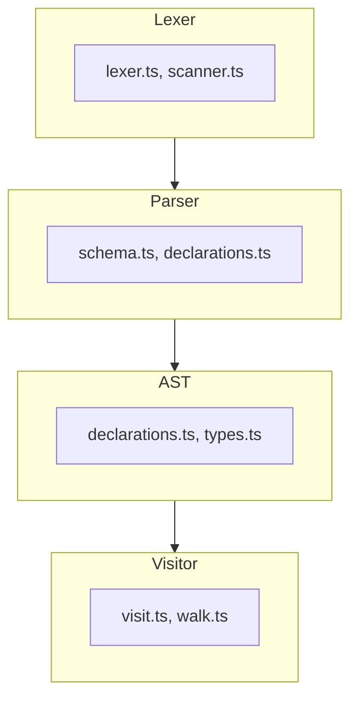
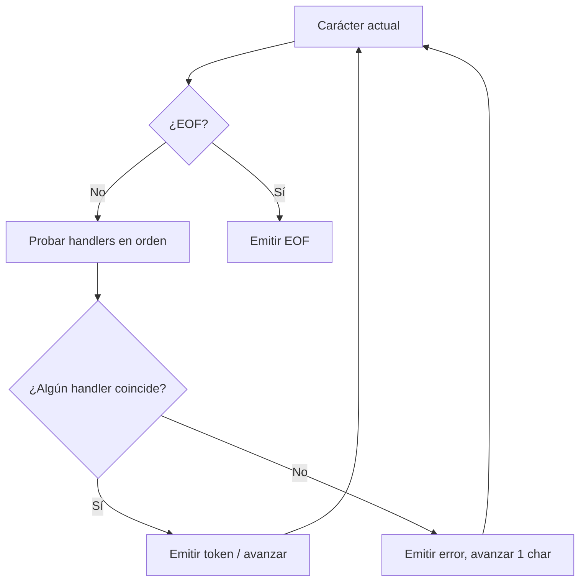
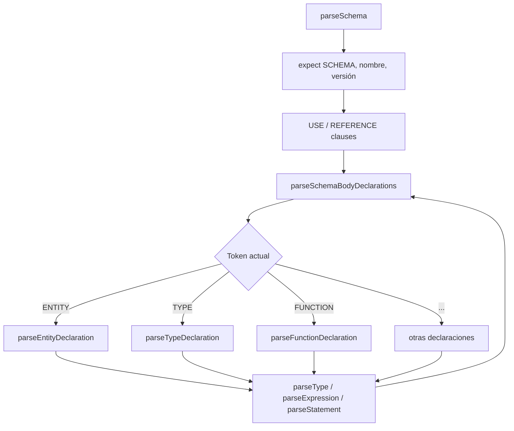
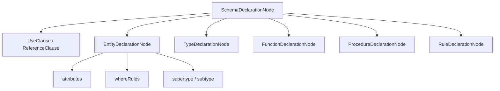

# Arquitectura del parser EXPRESS

## 1. Visión general

El paquete `@step-nc/express-parser` convierte texto EXPRESS en un árbol de sintaxis abstracta (AST) tipado y en una lista de diagnósticos (errores y advertencias de lexer y parser). La entrada es una cadena de texto; la salida es un `SchemaDeclarationNode` (raíz del AST) y un array de `ParseDiagnostic[]`.

Para el **uso** y la **API** del paquete, véase [README.md](./README.md). Para el **estado** y las **fases** del desarrollo, véase [ROADMAP.md](./ROADMAP.md).

## 2. Pipeline de parsing

El flujo de datos es lineal:

1. **Entrada:** cadena de texto (código EXPRESS).
2. **Lexer:** `lexExpress(source)` tokeniza el texto y produce un array de `Token[]` y diagnósticos de lexer.
3. **Parser:** Se construye un `ParserContext` con esos tokens; el parser por *recursive descent* consume tokens y construye el AST.
4. **Salida:** Un único nodo raíz `SchemaDeclarationNode` (AST) y un array `ParseDiagnostic[]`.

Diagrama del pipeline:

## 3. Capas del código

El código se organiza en cuatro capas dentro de `src/`:

| Carpeta      | Responsabilidad | Archivos clave |
|--------------|-----------------|----------------|
| `src/lexer/` | Tokenización del texto EXPRESS (cadena → tokens). | `lexer.ts`, `scanner.ts`, `context.ts` |
| `src/parser/`| Análisis sintáctico por recursive descent; construcción del AST y diagnósticos. | `schema.ts`, `declarations.ts`, `context.ts` |
| `src/ast/`   | Definición de los nodos del AST (declaraciones, tipos, expresiones, statements). | `declarations.ts`, `types.ts`, `base.ts` |
| `src/visitor/` | Recorrido del AST (pre/post order) y visitas por tipo de nodo. | `visit.ts`, `walk.ts`, `types.ts` |

Relación entre capas: el **Lexer** alimenta al **Parser** con tokens; el **Parser** produce el **AST**; el **AST** se recorre con el **Visitor**.

## 4. Lexer

El lexer convierte el texto EXPRESS en una secuencia de tokens. La función pública es `lexExpress(source)` (en `src/lexer/lexer.ts`). Internamente mantiene un contexto (posición, línea, columna) y recorre el texto en un bucle: en cada paso prueba una lista de *handlers* en orden; el primero que reconoce una secuencia de caracteres emite un token (o trivia) y avanza la posición. Si ningún handler coincide, se reporta un error y se avanza un carácter para no bloquear.

Orden de los handlers (según `HANDLERS` en `lexer.ts`):

1. Whitespace
2. Comentarios (línea y bloque)
3. Literal `?` (built-in)
4. Números
5. Cadenas (string literals)
6. Identificadores y palabras clave
7. Literal binario
8. Símbolos (operadores y delimitadores)

Al final se emite un token EOF.

## 5. Parser

El parser usa un **ParserContext** (en `src/parser/context.ts`) que mantiene la secuencia de tokens, la posición actual, métodos `peek()`, `consume()`, `expect()` y helpers para trivia y diagnósticos. El análisis es por **recursive descent**: cada regla gramatical se implementa como una función que consume tokens y devuelve un nodo del AST o delega en otras reglas.

- **Punto de entrada:** `parseSchema(ctx)` (en `src/parser/schema.ts`). Lee la palabra clave `SCHEMA`, el nombre, la versión opcional, las cláusulas USE/REFERENCE y luego el cuerpo del schema.
- **Cuerpo del schema:** Se llama a `parseSchemaBodyDeclarations(ctx)`, que en bucle invoca `parseDeclaration(ctx)` (en `src/parser/declarations.ts`) según el token actual.
- **parseDeclaration:** Despacha por tipo de declaración: entidad (`parseEntityDeclaration`), tipo (`parseTypeDeclaration`), función (`parseFunctionDeclaration`), procedimiento, regla, constante, etc. Cada una a su vez usa `parseType()`, `parseExpression()` o `parseStatement()` según la gramática EXPRESS.

## 6. AST y visitor

### AST

La raíz del AST es un **SchemaDeclarationNode**: representa un único schema EXPRESS con nombre, versión opcional, cláusulas de interfaz (USE/REFERENCE) y una lista de declaraciones hijas.

Tipos de declaraciones hijas (entre otros): entidad (`EntityDeclarationNode`), tipo (`TypeDeclarationNode`), función (`FunctionDeclarationNode`), procedimiento (`ProcedureDeclarationNode`), regla (`RuleDeclarationNode`), constante (`ConstantDeclarationNode`), etc. Cada entidad puede tener atributos explícitos, derivados, inversos, restricciones UNIQUE y WHERE; cada uno de estos se modela con nodos específicos (p. ej. `ExplicitAttributeNode`, `WhereRuleNode`). Los tipos y las expresiones tienen sus propios nodos en `src/ast/types.ts` y `src/ast/expressions.ts`.

Estructura simplificada del árbol:

### Visitor

- **`visit(ast, visitor)`** (en `src/visitor/visit.ts`): Recorre el AST en **pre-order**. El objeto `visitor` puede definir handlers por tipo de nodo (`onSchemaDeclaration`, `onEntityDeclaration`, etc.). Si un handler devuelve `'skip'`, no se visitan los hijos de ese nodo. Útil para inspección o transformaciones controladas.
- **`walk(ast, callback, options?)`** (en `src/visitor/walk.ts`): Recorre todos los nodos; el orden puede ser `'pre'` o `'post'` según `options.order`. No usa handlers por tipo; un único callback recibe cada nodo. Útil para recorridos genéricos.

Los ejemplos de uso están en [README.md](./README.md); aquí solo se describe el propósito de cada función.

## Más información

- **[README.md](./README.md)** — Uso del paquete, API (`parseExpress`, tipos del AST, `visit`, `walk`) y ejemplos.
- **[ROADMAP.md](./ROADMAP.md)** — Estado actual del desarrollo y fases del roadmap.
