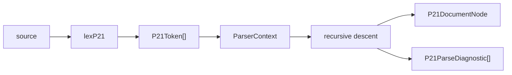
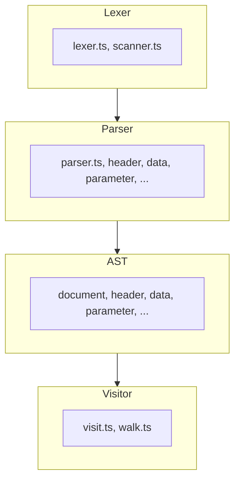
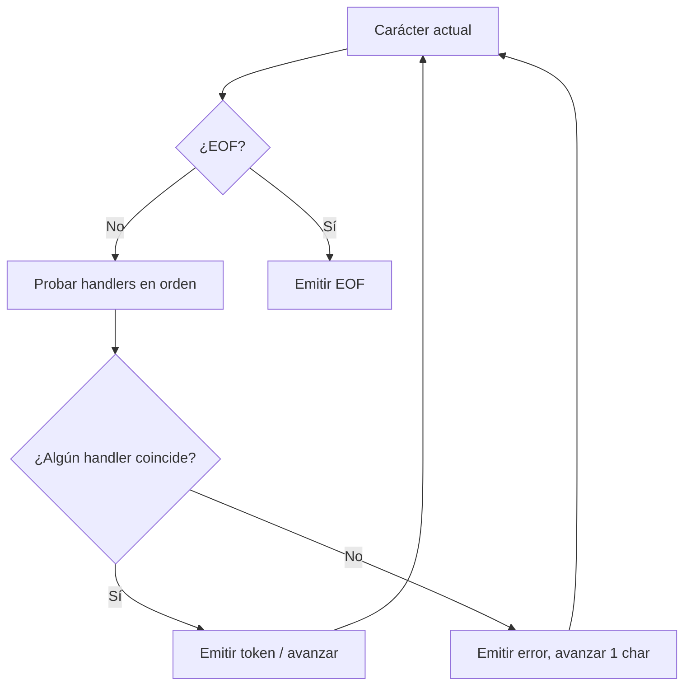
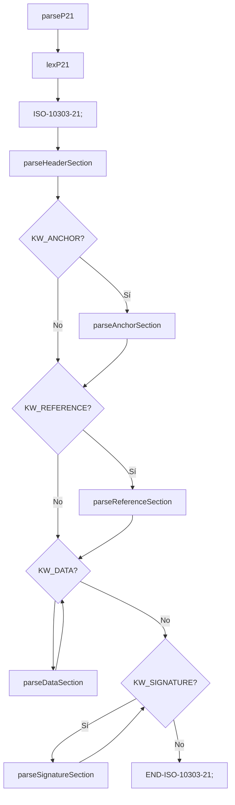

# Arquitectura del parser P21

## 1. Visión general

El paquete `@step-nc/p21-parser` convierte texto ISO 10303-21 (STEP Part 21) en un árbol de sintaxis abstracta (AST) tipado y en una lista de diagnósticos (errores y advertencias de lexer y parser). La entrada es una cadena de texto; la salida es un `P21DocumentNode` (raíz del AST) y un array de `P21ParseDiagnostic[]`.

Para el **uso** y la **API** del paquete, véase [README.md](./README.md). Para el **estado** y las **fases** del desarrollo, véase [ROADMAP.md](./ROADMAP.md).

## 2. Pipeline de parsing

El flujo de datos es lineal:

1. **Entrada:** cadena de texto (archivo P21 / exchange structure).
2. **Lexer:** `lexP21(source)` tokeniza el texto y produce un array de `P21Token[]` y diagnósticos de lexer (`P21LexDiagnostic[]`).
3. **Parser:** Se construye un `ParserContext` con esos tokens; el parser por *recursive descent* consume tokens y construye el AST por secciones (HEADER, DATA, ANCHOR, REFERENCE, SIGNATURE).
4. **Salida:** Un único nodo raíz `P21DocumentNode` (AST) y un array `P21ParseDiagnostic[]` (incluye diagnósticos del lexer mapeados a spans).

Diagrama del pipeline:



## 3. Capas del código

El código se organiza en cuatro capas dentro de `src/`:

| Carpeta       | Responsabilidad | Archivos clave |
|---------------|-----------------|----------------|
| `src/lexer/`  | Tokenización del texto P21 (cadena → tokens). | `lexer.ts`, `scanner.ts`, `context.ts`, `tables.ts`, `helpers.ts` |
| `src/parser/` | Análisis sintáctico por recursive descent; construcción del AST y diagnósticos. | `parser.ts`, `header.ts`, `data.ts`, `parameter.ts`, `anchor.ts`, `reference.ts`, `signature.ts`, `context.ts`, `common.ts` |
| `src/ast/`    | Definición de los nodos del AST (documento, secciones, entidades, parámetros). | `base.ts`, `document.ts`, `header.ts`, `data.ts`, `parameter.ts`, `anchor.ts`, `reference.ts`, `signature.ts`, `children.ts` |
| `src/visitor/`| Recorrido del AST (pre/post order) y visitas por tipo de nodo. | `visit.ts`, `walk.ts`, `types.ts` |

Relación entre capas: el **Lexer** alimenta al **Parser** con tokens; el **Parser** produce el **AST**; el **AST** se recorre con el **Visitor**.



## 4. Lexer

El lexer convierte el texto P21 en una secuencia de tokens. La función pública es `lexP21(source)` (en `src/lexer/lexer.ts`). Internamente mantiene un `LexerContext` (posición, línea, columna) y recorre el texto en un bucle: en cada paso prueba una lista de *handlers* en orden; el primero que reconoce una secuencia emite un token y avanza. Si ningún handler coincide, se reporta un error y se avanza un carácter.

Orden de los handlers (según `HANDLERS` en `lexer.ts`):

1. Whitespace
2. Comentarios (`/* ... */`)
3. Delimitador ISO-10303-21 / END-ISO-10303-21
4. Cadenas (entre comillas simples, con directivas de control)
5. Literal binario
6. Enumeración
7. Referencia a entidad o constante de entidad
8. Referencia a valor o constante de valor
9. Contenido delimitado por ángulo (p. ej. para ANCHOR/RESOURCE)
10. Números (entero, real)
11. Palabra clave definida por usuario
12. Palabra clave estándar (HEADER, DATA, ENDSEC, etc.)
13. Nombre de tag
14. Símbolos (`;`, `,`, `(`, `)`, `=`, `$`, `*`, etc.)

Al final se emite un token EOF.



## 5. Parser

El parser usa un **ParserContext** (en `src/parser/context.ts`) que mantiene la secuencia de tokens, la posición actual, métodos `peek()`, `consume()`, `expect()`, `check()` y helpers para diagnósticos y spans. El análisis es por **recursive descent**: cada sección o regla gramatical se implementa como una función que consume tokens y devuelve un nodo del AST.

- **Punto de entrada:** `parseP21(source, options?)` (en `src/parser/parser.ts`). Llama a `lexP21(source)`, crea el `ParserContext` y luego:
  1. Espera `ISO-10303-21;`
  2. Parsea la sección HEADER (obligatoria) con `parseHeaderSection`
  3. Parsea opcionalmente ANCHOR con `parseAnchorSection`
  4. Parsea opcionalmente REFERENCE con `parseReferenceSection`
  5. Parsea una o más secciones DATA con `parseDataSection`
  6. Parsea cero o más secciones SIGNATURE con `parseSignatureSection`
  7. Espera `END-ISO-10303-21;`
- **Recuperación de errores:** Ante errores sintácticos se usa `synchronize()` para avanzar hasta un delimitador de sección o de instancia y seguir parseando.
- **Parámetros:** La sección DATA y las entidades usan `parseParameter` (en `parameter.ts`) para listas de parámetros, con soporte para valores tipados, referencias, listas, omitidos y null.



## 6. AST y visitor

### AST

La raíz del AST es un **P21DocumentNode**: representa el documento completo con `header` (HeaderSectionNode), opcionalmente `anchor` (AnchorSectionNode), opcionalmente `reference` (ReferenceSectionNode), `data` (array de DataSectionNode) y `signatures` (array de SignatureSectionNode). Cada sección y cada entidad/parámetro tienen un `span` (start/end con offset, line, column) para diagnósticos y herramientas.

Estructura simplificada del árbol:

```mermaid
flowchart TB
  D[P21DocumentNode] --> H[HeaderSectionNode]
  D --> A[AnchorSectionNode opt]
  D --> R[ReferenceSectionNode opt]
  D --> DS[DataSectionNode[]]
  D --> SS[SignatureSectionNode[]]
  H --> HE[HeaderEntityNode]
  DS --> E[SimpleEntityInstance / ComplexEntityInstance]
  E --> SR[SimpleRecordNode]
  SR --> P[ParameterNode]
  A --> AN[AnchorNode / AnchorTagNode]
```

### Visitor

- **`visit(ast, visitor)`** (en `src/visitor/visit.ts`): Recorre el AST en **pre-order**. El objeto `visitor` puede definir handlers por tipo de nodo (`onP21Document`, `onHeaderSection`, `onDataSection`, `onSimpleEntityInstance`, etc.). Si un handler devuelve `'skip'`, no se visitan los hijos de ese nodo.
- **`walk(ast, callback, options?)`** (en `src/visitor/walk.ts`): Recorre todos los nodos; el orden puede ser `'pre'` o `'post'` según `options.order`. Un único callback recibe cada nodo.

Los ejemplos de uso están en [README.md](./README.md).

## Más información

- **[README.md](./README.md)** — Uso del paquete, API (`parseP21`, `lexP21`, tipos del AST, `visit`, `walk`) y ejemplos.
- **[ROADMAP.md](./ROADMAP.md)** — Estado actual del desarrollo, fases y limitaciones conocidas.
