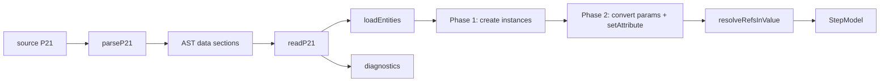
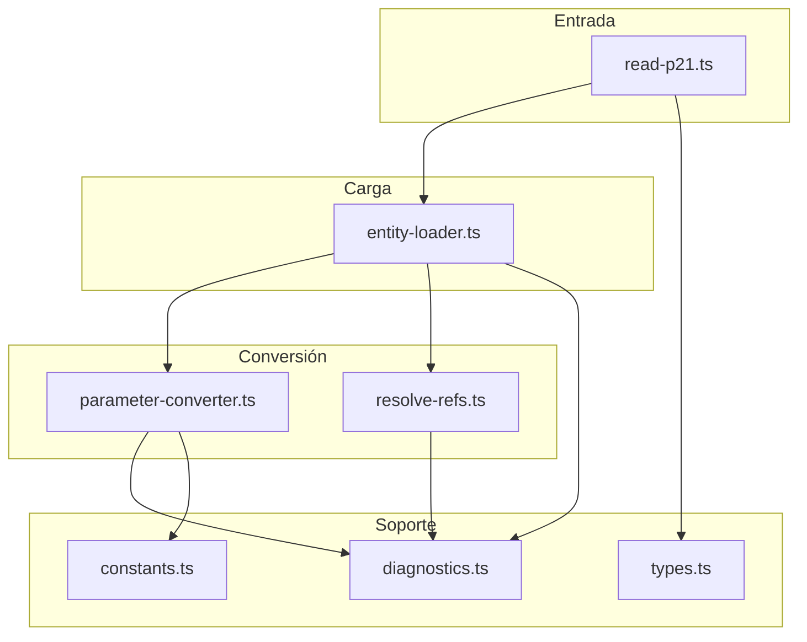

# Arquitectura del P21 Reader

## 1. Visión general

El paquete `@step-nc/p21-reader` carga archivos P21 (ISO 10303-21) en un `StepModel`. Toma texto Part 21 y un `ExpressSchema` resuelto (de `@step-nc/express-dictionary`), parsea el P21 con `@step-nc/p21-parser`, convierte cada parámetro a un valor de atributo tipado y rellena las instancias en el modelo. Las referencias entre instancias (#id) se resuelven en una segunda fase para soportar referencias hacia adelante.

Para el **uso** y la **API** del paquete, véase [README.md](./README.md). Para el **estado** y las **fases** del desarrollo, véase [ROADMAP.md](./ROADMAP.md).

## 2. Pipeline de lectura

El flujo de datos es:

1. **Entrada:** cadena de texto P21 y un `ExpressSchema` resuelto.
2. **Parser P21:** `parseP21(source)` (de `@step-nc/p21-parser`) produce un AST con header y secciones DATA (lista de entidades con id y parámetros).
3. **readP21:** Si hay errores de parse y no se usa `continueOnParseError`, devuelve un modelo vacío y los diagnósticos del parser. En caso contrario continúa.
4. **Carga en dos fases:** `loadEntities(dataSections, schema, model, strictRefs)`:
   - **Fase 1:** Crear todas las instancias en el modelo (vacías) y registrar qué entidades del AST se crearon correctamente.
   - **Fase 2:** Para cada instancia creada, convertir los parámetros del AST a `AttributeValue` según el tipo del atributo en el schema, asignar atributos y luego resolver referencias (placeholders con `entityName === ''` se reemplazan por el tipo real de la instancia referenciada).
5. **Salida:** `StepModel` poblado y array de diagnósticos (parser + reader).

## 3. Capas del código

El código se organiza en `src/` de la siguiente forma:

| Archivo | Responsabilidad |
|---------|-----------------|
| `types.ts` | Opciones de lectura (`P21ReadOptions`) y resultado (`ReadResult`). |
| `diagnostics.ts` | Códigos y creación de `ReaderDiagnostic`, helpers (`errorDiag`, `warningDiag`, `hasReaderErrors`, `formatReaderDiagnostic`, etc.). |
| `parameter-converter.ts` | Conversión de `ParameterNode` (P21) a `AttributeValue`: primitivos, listas/sets/bags/arrays, refs (#id), SELECT (TypedParameter), constantes, omitidos/nulos. |
| `entity-loader.ts` | `loadEntities`: dos fases (crear instancias, luego rellenar atributos y resolver refs). Resolución del nombre de entidad para instancias simples y complejas (supertypes). |
| `resolve-refs.ts` | `resolveRefsInValue`: recorre un valor y reemplaza refs placeholder (entityName vacío) por refs resueltas usando el modelo. |
| `constants.ts` | `findConstant`: búsqueda de constantes por nombre en el schema (sin evaluación de expresiones). |
| `read-p21.ts` | Punto de entrada: parse P21, opcionalmente continuar con errores de parse, llamar a `loadEntities` y combinar diagnósticos. |

## 4. Conversión de parámetros

`convertParameter(param, typeDescriptor, schema, context)` hace el dispatch por `param.type` (nodos del parser P21):

- **OmittedParameter** → `INDETERMINATE`
- **NullParameter** → `null`
- **IntegerValue / RealValue / StringValue / EnumerationValue / BinaryValue** → valor escalar (strings se decodifican `''` → `'`).
- **EntityRef** → `createRef(id, '')` (placeholder; la fase 2 rellena `entityName` con `resolveRefsInValue`).
- **ValueRef** → advertencia y `INDETERMINATE` (no soportado).
- **ConstantEntityRef / ConstantValueRef** → si la constante está en el schema se deja como `INDETERMINATE` (sin evaluación); si no, advertencia y `INDETERMINATE`.
- **List** → según el `typeDescriptor` se construye LIST, SET, BAG o ARRAY; cada elemento se convierte recursivamente.
- **TypedParameter** → si el tipo esperado es SELECT, el keyword desambigua la opción y se construye un `SelectValue`; si no, el keyword se trata como tipo nombrado y se convierte el parámetro interno.

Los diagnósticos se acumulan en el array pasado o devuelto (`ConvertResult.diagnostics`).

## 5. Carga en dos fases

**Fase 1 (entity-loader):** Recorrer todas las entidades de las secciones DATA. Para cada una:

- Resolver el nombre de entidad (instancia simple → keyword; instancia compleja → primer supertipo conocido en el schema).
- Comprobar que la entidad exista y sea instanciable (no abstracta).
- Crear la instancia en el modelo con `createInstanceWithId(id, entityName)` y guardar la asociación (nodo AST, definición, instancia) para la fase 2.

**Fase 2:** Para cada instancia creada:

- Obtener la lista de atributos (propios + heredados) según el schema.
- Para cada parámetro del AST, obtener el tipo del atributo, llamar a `convertParameter` y asignar con `setAttribute`. Si hay más parámetros que atributos, se reporta `EXTRA_PARAMETER`; si faltan requeridos, `REQUIRED_ATTRIBUTE_MISSING`.
- Recorrer los valores asignados y llamar a `resolveRefsInValue` para reemplazar refs placeholder por refs con `entityName` resuelto. Las refs colgantes generan error o advertencia según `strictRefs`.

Así se soportan referencias hacia adelante (#2 puede referenciar a #5 que aparece más abajo en el archivo).

## 6. Diagnósticos

Los códigos de reader (`ReaderDiagnosticCode`) cubren: entidad desconocida o abstracta, desajuste de tipo de parámetro, atributo requerido faltante, parámetro extra, refs colgantes (entidad o valor), constante desconocida, ID duplicado y agregación inválida. Se combinan con los diagnósticos del parser P21 en el `ReadResult.diagnostics` sin modificar el tipo de cada uno (union `P21ParseDiagnostic | ReaderDiagnostic`).

## Más información

- **[README.md](./README.md)** — Uso del paquete, API y ejemplos.
- **[ROADMAP.md](./ROADMAP.md)** — Estado actual y fases del roadmap.
