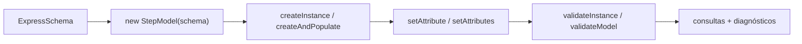
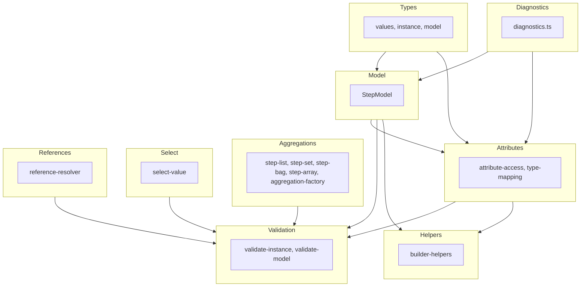
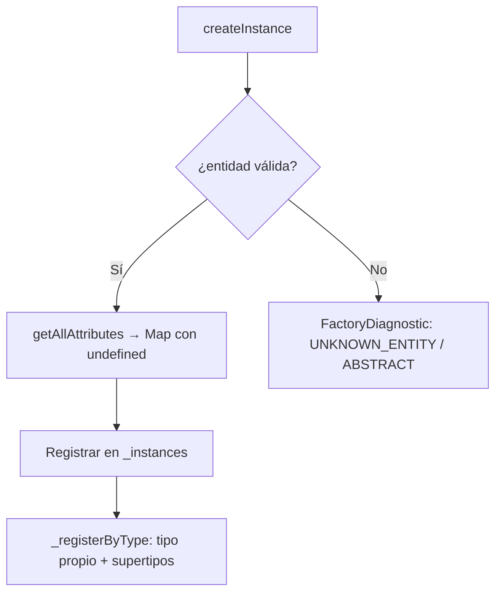
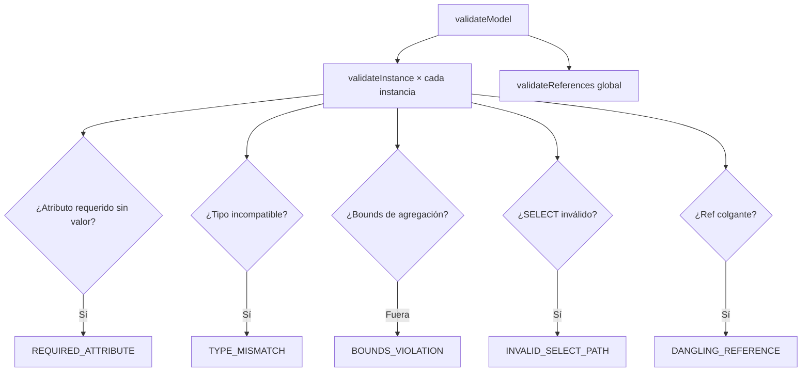

# Arquitectura del factory EXPRESS

## 1. Visión general

El paquete `@step-nc/step-factory` es el motor de instancias runtime del ecosistema STEP-NC. Recibe un `ExpressSchema` resuelto (producido por `@step-nc/express-dictionary`) y permite crear, poblar y validar instancias de entidades STEP en memoria. La entrada es un schema; la salida es un modelo poblado con instancias validadas y diagnósticos.

Para el **uso** y la **API** del paquete, véase [README.md](./README.md). Para el **estado** y las **fases** del desarrollo, véase [ROADMAP.md](./ROADMAP.md).

## 2. Pipeline de uso

El flujo de datos típico es:

1. **Entrada:** `ExpressSchema` resuelto (con entidades, tipos, herencia y atributos enlazados).
2. **StepModel:** Se crea un `StepModel(schema)` — contenedor de instancias ligado al schema.
3. **Instanciación:** `createInstance(entityName)` valida que la entidad exista y no sea abstracta, crea la instancia con sus atributos inicializados a `undefined`.
4. **Población:** `setAttribute(instance, name, value)` o `createAndPopulate(model, entityName, attrs)` asigna valores con validación de tipos.
5. **Validación:** `validateInstance(instance, model)` o `validateModel(model)` verifica completitud, tipos, bounds y referencias.
6. **Consulta:** `getInstance(id)`, `getInstancesOf(entityName)`, `findReferencesTo(model, id)`, etc.

## 3. Capas del código

El código se organiza en capas dentro de `src/`:

| Carpeta | Responsabilidad | Archivos clave |
|---------|-----------------|----------------|
| `src/types/` | Sistema de tipos core: branded IDs, valores, instancias, opciones del modelo. | `values.ts`, `instance.ts`, `model.ts` |
| `src/diagnostics.ts` | Códigos de diagnóstico, creación y formateo de `FactoryDiagnostic`. | `diagnostics.ts` |
| `src/model/` | `StepModel` — contenedor central con creación, consulta, eliminación e indexación por tipo. | `step-model.ts` |
| `src/attributes/` | Acceso a atributos (get/set), validación de compatibilidad de tipos, nombre esperado. | `attribute-access.ts`, `type-mapping.ts` |
| `src/aggregations/` | Colecciones tipadas inmutables (LIST, SET, BAG, ARRAY), operaciones y validación de bounds. | `step-list.ts`, `step-set.ts`, `step-bag.ts`, `step-array.ts`, `aggregation-factory.ts` |
| `src/select/` | Valores SELECT: creación, validación contra el schema, extracción. | `select-value.ts` |
| `src/references/` | Referencias entre instancias: creación, resolución, detección de danglings, búsqueda inversa. | `reference-resolver.ts` |
| `src/validation/` | Validación a nivel de instancia y de modelo completo. | `validate-instance.ts`, `validate-model.ts` |
| `src/helpers/` | Helpers de alto nivel: `createAndPopulate`, `cloneInstance`, `instanceToRecord`. | `builder-helpers.ts` |

Relación entre capas: los **Types** definen el sistema de valores; el **Model** gestiona instancias; los **Attributes** leen/escriben valores con validación; las **Aggregations**, **Select** y **References** manejan valores compuestos; la **Validation** orquesta todas las comprobaciones.

## 4. Tipos (sistema de valores)

- **`InstanceId`:** Branded type (`number & { __brand: 'InstanceId' }`) para evitar confusión con números planos. Se crea con `asInstanceId(n)`.
- **`AttributeValue`:** Unión de todos los valores posibles en un atributo STEP: primitivos (`number`, `string`, `boolean`, `null`), binarios (`Uint8Array`), `InstanceRef`, `StepAggregation`, `SelectValue`, `Indeterminate`.
- **`InstanceRef`:** Referencia a otra instancia: `{ kind: 'ref', id: InstanceId, entityName: string }`.
- **`SelectValue`:** Valor envuelto en un SELECT: `{ kind: 'select', typePath: string[], value: AttributeValue }`.
- **`StepAggregation`:** Unión de `StepList`, `StepSet`, `StepBag`, `StepArray` — cada una con `kind` discriminante y `elements` de solo lectura.
- **`INDETERMINATE`:** Symbol sentinel para el valor `?` de EXPRESS.
- **`EntityInstance`:** Representación runtime de una instancia: `id`, `typeName` (UPPERCASE), `definition` (enlace al `EntityDefinition` del schema), `attributes` (Map nombre → valor) y `attributeDefinitions` (Map nombre → `ExplicitAttribute`).

Los tipos usan `AttributeValueBase` (sin `SelectValue`) como tipo intermedio para evitar referencias circulares en la emisión de `.d.ts`; `SelectValue.value` se tipa como `AttributeValueBase | SelectValue` y `AttributeValue` es la unión final.

## 5. StepModel

`StepModel` es la clase central del paquete. Almacena instancias en un `Map<InstanceId, EntityInstance>` y mantiene un índice secundario `_byType: Map<string, Set<InstanceId>>` para consultas polimórficas eficientes.

- **Creación:** `createInstance` auto-incrementa el ID; `createInstanceWithId` permite IDs explícitos (para importar archivos P21). Ambas validan que la entidad exista en el schema y que no sea abstracta (`definition.abstract || !definition.instantiable`).
- **Atributos iniciales:** Al crear, se obtiene `getAllAttributes(definition)` del diccionario (incluye heredados) y se inicializan todos a `undefined`.
- **Indexación polimórfica:** `_registerByType` registra la instancia bajo su tipo propio y bajo todos sus supertipos (`getSupertypeChain`), permitiendo que `getInstancesOf('geometric_representation_item')` devuelva también instancias de subtipos.
- **Eliminación:** `deleteInstance` limpia tanto el mapa de instancias como los índices por tipo.

## 6. Atributos y validación de tipos

`attribute-access.ts` expone `getAttribute`, `setAttribute`, `setAttributes`, etc. Todos normalizan el nombre a UPPERCASE.

`type-mapping.ts` contiene `isValueCompatible(descriptor, value, schema)`, que recorre recursivamente el `TypeDescriptor` del schema para verificar que el valor runtime sea compatible:

- **simple:** comprueba contra el tipo base (REAL → number, STRING → string, BOOLEAN → boolean, BINARY → Uint8Array, etc.).
- **enumeration:** verifica que el string sea un valor del enum.
- **entity:** acepta `InstanceRef` cuyo `entityName` sea compatible (la entidad misma o un subtipo).
- **aggregation:** verifica que sea un `StepAggregation` del kind correcto.
- **select:** acepta `SelectValue`.
- **defined:** resuelve a la base con `resolveToBaseType`.

`getExpectedTypeName` produce un nombre legible para mensajes de diagnóstico.

## 7. Agregaciones

Los cuatro tipos de colección EXPRESS se modelan como interfaces inmutables con un `kind` discriminante:

| Tipo | `kind` | Particularidades |
|------|--------|-----------------|
| `StepList` | `'list'` | Ordenada, permite duplicados |
| `StepSet` | `'set'` | Ordenada, sin duplicados (de primitivos) |
| `StepBag` | `'bag'` | Sin orden garantizado, permite duplicados |
| `StepArray` | `'array'` | Índice inferior configurable, posiciones null para huecos |

`addToAggregation` y `removeFromAggregation` devuelven nuevas instancias (inmutabilidad). `validateAggregationBounds` compara el tamaño contra los bounds declarados en el schema (extrae literales enteros de las expresiones AST).

## 8. SELECT y referencias

### SELECT
`createSelectValue(typePath, value)` envuelve un valor en un SELECT con la ruta de tipos (SELECT → tipo concreto). `validateSelectValue` comprueba que la opción final esté en las opciones válidas del descriptor SELECT (usando `getSelectOptions` del diccionario).

### Referencias
`createRef(id, entityName)` crea un `InstanceRef`. `resolveRef(model, ref)` busca la instancia por ID. `validateReferences(model)` recorre todas las instancias y detecta referencias colgantes (`DANGLING_REFERENCE`), entrando recursivamente en agregaciones y SELECTs. `findReferencesTo(model, targetId)` hace la búsqueda inversa: qué instancias apuntan a un ID dado.

## 9. Validación

Dos niveles de validación:

### Instancia (`validateInstance`)
Para cada atributo de la instancia:
1. **Requerido:** Si `undefined` y no `optional`, emite `REQUIRED_ATTRIBUTE`.
2. **Tipo:** Si no pasa `isValueCompatible`, emite `TYPE_MISMATCH`.
3. **Bounds:** Si es agregación, valida bounds con `validateAggregationBounds`.
4. **SELECT:** Si es SELECT, valida con `validateSelectValue`.
5. **Referencia:** Si es `InstanceRef`, verifica que la instancia referenciada exista.

### Modelo (`validateModel`)
1. Ejecuta `validateInstance` sobre todas las instancias.
2. Ejecuta `validateReferences` para detección global de danglings (sin duplicar diagnósticos).
3. Emite un `info` indicando que la validación de reglas UNIQUE no está implementada (v0.2).

## 10. Helpers

- **`createAndPopulate`** combina `createInstance` + `setAttributes` en un solo paso; devuelve `PopulateResult`.
- **`cloneInstance`** crea una nueva instancia del mismo tipo y copia todos los valores de la fuente.
- **`instanceToRecord`** serializa una instancia a un plain object `{ id, typeName, attributes }` (convierte `undefined` a `null`).

## Más información

- **[README.md](./README.md)** — Uso del paquete, API completa (`StepModel`, atributos, agregaciones, SELECT, referencias, validación, helpers) con ejemplos.
- **[ROADMAP.md](./ROADMAP.md)** — Estado actual del desarrollo y fases futuras (multi-schema, UNIQUE, WHERE, DERIVED, transacciones).
