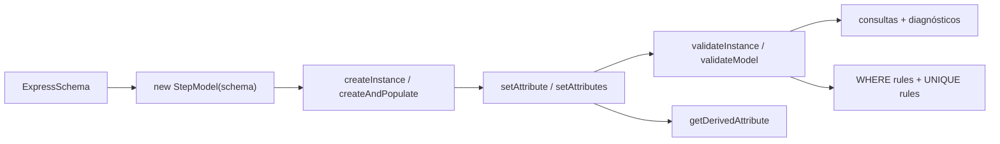
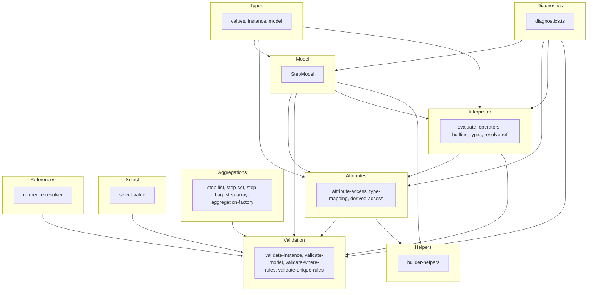
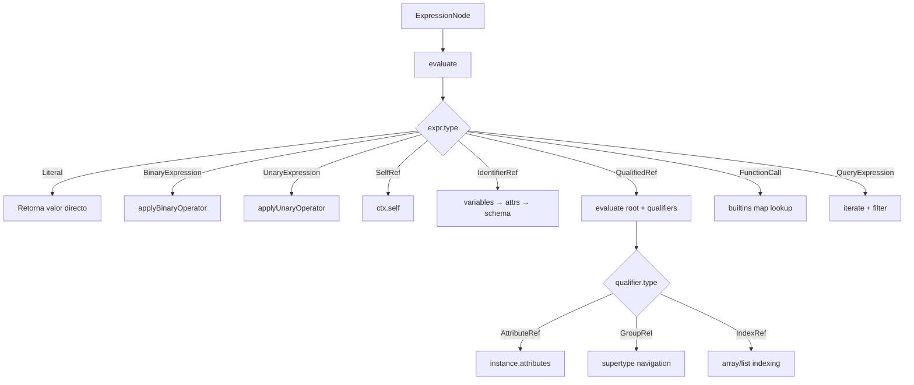
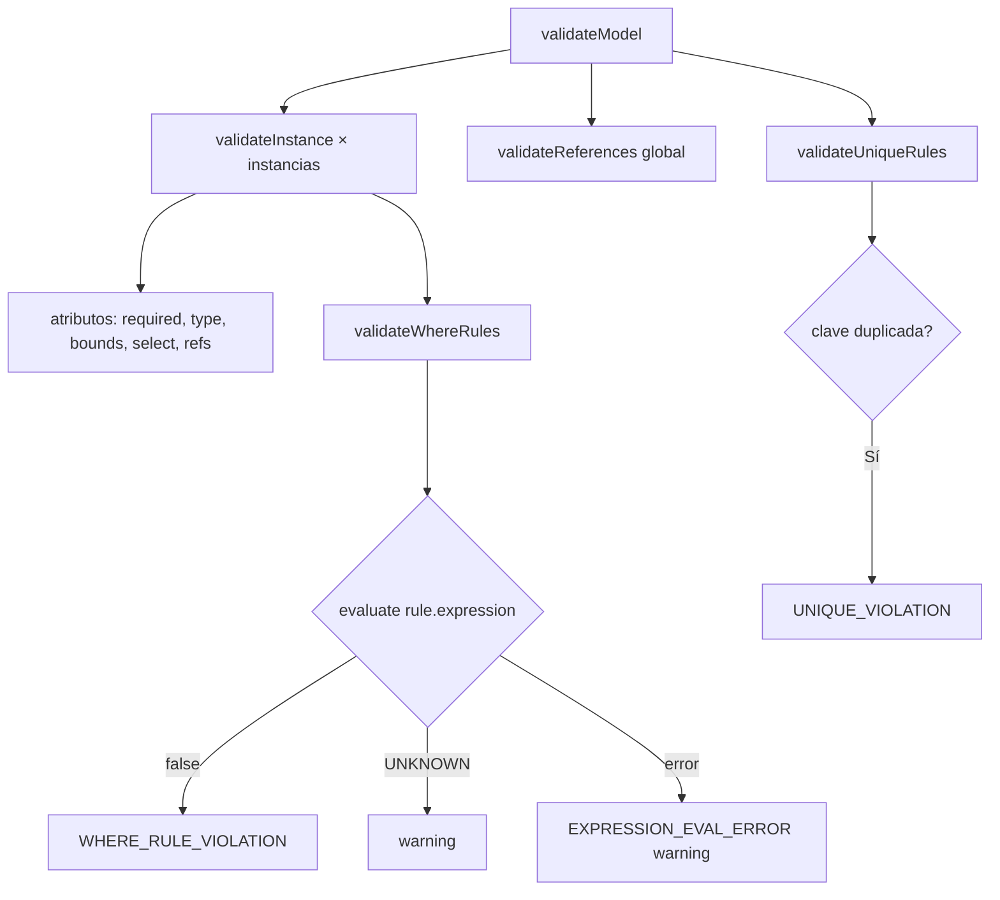

# Arquitectura del factory EXPRESS

## 1. Visión general

El paquete `@step-nc/step-factory` es el motor de instancias runtime del ecosistema STEP-NC. Recibe un `ExpressSchema` resuelto (producido por `@step-nc/express-dictionary`) y permite crear, poblar y validar instancias de entidades STEP en memoria. La entrada es un schema; la salida es un modelo poblado con instancias validadas y diagnósticos.

Para el **uso** y la **API** del paquete, véase [README.md](./README.md). Para el **estado** y las **fases** del desarrollo, véase [ROADMAP.md](./ROADMAP.md).

## 2. Pipeline de uso

El flujo de datos típico es:

1. **Entrada:** `ExpressSchema` resuelto (con entidades, tipos, herencia y atributos enlazados).
2. **StepModel:** Se crea un `StepModel(schema)` — contenedor de instancias ligado al schema. Opcionalmente con un `SchemaRegistry` para soporte multi-schema.
3. **Instanciación:** `createInstance(entityName)` valida que la entidad exista y no sea abstracta, crea la instancia con sus atributos inicializados a `undefined`.
4. **Población:** `setAttribute(instance, name, value)` o `createAndPopulate(model, entityName, attrs)` asigna valores con validación de tipos. Los atributos DERIVED son de solo lectura.
5. **Validación:** `validateInstance(instance, model)` o `validateModel(model)` verifica completitud, tipos, bounds, referencias, reglas WHERE y reglas UNIQUE.
6. **Consulta:** `getInstance(id)`, `getInstancesOf(entityName)`, `findReferencesTo(model, id)`, `getDerivedAttribute(instance, name, model)`, etc.

## 3. Capas del código

El código se organiza en capas dentro de `src/`:

| Carpeta | Responsabilidad | Archivos clave |
|---------|-----------------|----------------|
| `src/types/` | Sistema de tipos core: branded IDs, valores, instancias, opciones del modelo. | `values.ts`, `instance.ts`, `model.ts` |
| `src/diagnostics.ts` | Códigos de diagnóstico, creación y formateo de `FactoryDiagnostic`. | `diagnostics.ts` |
| `src/model/` | `StepModel` — contenedor central con creación, consulta, eliminación e indexación por tipo. | `step-model.ts` |
| `src/attributes/` | Acceso a atributos (get/set), validación de compatibilidad de tipos, acceso a DERIVED. | `attribute-access.ts`, `type-mapping.ts`, `derived-access.ts` |
| `src/interpreter/` | Intérprete de expresiones EXPRESS: evaluación recursiva, operadores, built-ins. | `evaluate.ts`, `operators.ts`, `builtins.ts`, `types.ts`, `resolve-ref.ts` |
| `src/aggregations/` | Colecciones tipadas inmutables (LIST, SET, BAG, ARRAY), operaciones y validación de bounds. | `step-list.ts`, `step-set.ts`, `step-bag.ts`, `step-array.ts`, `aggregation-factory.ts` |
| `src/select/` | Valores SELECT: creación, validación contra el schema, extracción. | `select-value.ts` |
| `src/references/` | Referencias entre instancias: creación, resolución, detección de danglings, búsqueda inversa. | `reference-resolver.ts` |
| `src/validation/` | Validación a nivel de instancia y de modelo completo, incluyendo WHERE y UNIQUE. | `validate-instance.ts`, `validate-model.ts`, `validate-where-rules.ts`, `validate-unique-rules.ts` |
| `src/helpers/` | Helpers de alto nivel: `createAndPopulate`, `cloneInstance`, `instanceToRecord`. | `builder-helpers.ts` |

## 4. Tipos (sistema de valores)

- **`InstanceId`:** Branded type (`number & { __brand: 'InstanceId' }`) para evitar confusión con números planos. Se crea con `asInstanceId(n)`.
- **`AttributeValue`:** Unión de todos los valores posibles en un atributo STEP: primitivos (`number`, `string`, `boolean`, `null`), binarios (`Uint8Array`), `InstanceRef`, `StepAggregation`, `SelectValue`, `Indeterminate`.
- **`InstanceRef`:** Referencia a otra instancia: `{ kind: 'ref', id: InstanceId, entityName: string }`.
- **`SelectValue`:** Valor envuelto en un SELECT: `{ kind: 'select', typePath: string[], value: AttributeValue }`.
- **`StepAggregation`:** Unión de `StepList`, `StepSet`, `StepBag`, `StepArray` — cada una con `kind` discriminante y `elements` de solo lectura.
- **`INDETERMINATE`:** Symbol sentinel para el valor `?` de EXPRESS.
- **`EntityInstance`:** Representación runtime de una instancia: `id`, `typeName` (UPPERCASE), `definition` (enlace al `EntityDefinition` del schema), `attributes` (Map nombre → valor) y `attributeDefinitions` (Map nombre → `ExplicitAttribute`).

## 5. StepModel

`StepModel` es la clase central del paquete. Almacena instancias en un `Map<InstanceId, EntityInstance>` y mantiene un índice secundario `_byType: Map<string, Set<InstanceId>>` para consultas polimórficas eficientes.

- **Creación:** `createInstance` auto-incrementa el ID; `createInstanceWithId` permite IDs explícitos (para importar archivos P21). Ambas validan que la entidad exista en el schema y que no sea abstracta.
- **Multi-schema:** Opcionalmente acepta un `SchemaRegistry` en las opciones. Los schemas resueltos vía `resolveInterfaces()` ya contienen las entidades importadas, por lo que un `StepModel(resolvedSchema)` trabaja con todas las entidades disponibles. El método `getEntityOriginSchema` permite consultar el schema de origen de una entidad.
- **Indexación polimórfica:** `_registerByType` registra la instancia bajo su tipo propio y bajo todos sus supertipos, permitiendo que `getInstancesOf('geometric_representation_item')` devuelva también instancias de subtipos.

## 6. Intérprete de expresiones

El intérprete es un tree-walker recursivo sobre nodos `ExpressionNode` del AST de express-parser. Evalúa expresiones en un `EvalContext` que provee acceso al `self` (instancia actual), `model` (para resolver refs), `schema` (para lookups de tipos) y `variables` (para bindings de QUERY).

**Componentes:**

- **`evaluate.ts`** — Función principal `evaluate(expr, ctx)` con dispatch por `expr.type`. Maneja literales, operadores binarios/unarios, referencias, funciones, QUERY, agregados e intervalos.
- **`operators.ts`** — Dispatch de operadores binarios y unarios. Implementa aritmética, comparaciones, lógica de tres valores (TRUE/FALSE/UNKNOWN), concatenación de strings, igualdad de instancias y operador IN.
- **`builtins.ts`** — Mapa de funciones built-in EXPRESS (ABS, SIZEOF, EXISTS, TYPEOF, USEDIN, etc.). Las funciones de usuario retornan INDETERMINATE con warning.
- **`resolve-ref.ts`** — Helpers para resolución de referencias (atributos en instancias, calificadores de grupo, indexación de agregados).
- **`types.ts`** — Tipos del intérprete: `EvalContext`, `EvalValue`, `EvalError`, `EVAL_INDETERMINATE`.

## 7. Atributos DERIVED

Los atributos DERIVED se computan mediante el intérprete de expresiones. La función `getDerivedAttribute(instance, attrName, model)` busca la definición del atributo derivado, construye un `EvalContext` con `self = instance`, y evalúa la expresión.

- **Lazy evaluation:** Se computa en cada acceso sin caché (caching planificado para v0.2.1).
- **Read-only:** `setAttribute` rechaza escrituras a atributos DERIVED.
- **`hasAttribute`** ahora retorna `true` también para atributos DERIVED.

## 8. Validación

Tres niveles de validación:

### Instancia (`validateInstance`)
Para cada atributo: requerido, tipo, bounds, SELECT, referencia. Adicionalmente evalúa las reglas WHERE del entity.

### WHERE rules (`validateWhereRules`)
Recolecta todas las WHERE rules de la entidad (incluyendo heredadas de supertipos) y las evalúa con el intérprete. Resultados:
- `true` → pasa
- `false` → `WHERE_RULE_VIOLATION` (error)
- `INDETERMINATE` → warning (lógica de tres valores)
- Error de evaluación → warning (degradación graciosa)

### UNIQUE rules (`validateUniqueRules`)
Verifica unicidad entre instancias del mismo tipo (incluyendo subtipos). Para cada UNIQUE rule, construye una clave compuesta a partir de los valores de los atributos listados y detecta duplicados con un HashMap (O(n) por regla).

### Modelo (`validateModel`)
1. `validateInstance` × cada instancia (incluye WHERE)
2. `validateReferences` global (sin duplicar)
3. `validateUniqueRules` global

## 9. Helpers

- **`createAndPopulate`** combina `createInstance` + `setAttributes` en un solo paso.
- **`cloneInstance`** crea una nueva instancia del mismo tipo y copia todos los valores.
- **`instanceToRecord`** serializa una instancia a un plain object.

## Más información

- **[README.md](./README.md)** — Uso del paquete, API completa con ejemplos.
- **[ROADMAP.md](./ROADMAP.md)** — Estado actual del desarrollo y fases futuras.
